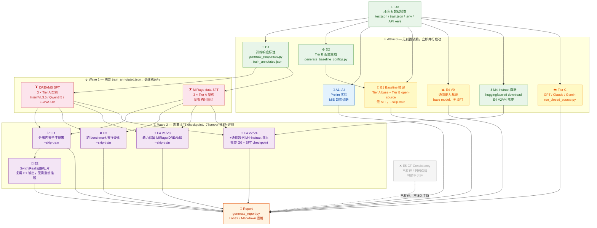

# DREAMS 论文章节结构与实验命令指南

> **说明**: 本文档覆盖论文各章节的逻辑、内容、对应表格，以及每个子实验的具体运行命令（按模型拆分到最细粒度）。
> 所有命令均在 `mis_safety` conda 环境中运行，工作目录 `/mnt/hdd/xuran/vlm_safety_harness/`。
> **78server 分工**: 推理/测试专用清单见 `docs/main_experiments/78server_inference_only_assignment.md`。本文中的 `[78server]` 表示可直接分配给 78server，`[78server 条件]` 表示等 checkpoint/API 到位后可分配，`[训练机]` 表示不要分给 78server。
> **E5 状态**: E5 counterfactual consistency 暂时取消，不纳入当前论文主实验和执行队列；相关代码、配置、数据路径和历史说明仅归档保留，不删除。

---

## 目录

- [1 论文整体叙事链](#1-论文整体叙事链)
- [2 Section 1 — Introduction](#2-section-1--introduction)
- [3 Section 2 — Related Work](#3-section-2--related-work)
- [4 Section 3 — DREAMS Dataset](#4-section-3--dreams-dataset)
- [5 Section 4 — Preliminary Analysis (A1–A4)](#5-section-4--preliminary-analysis-a1a4)
- [6 Section 5 — Main Experiments (E1–E4; E5 archived)](#6-section-5--main-experiments-e1e4-e5-archived)
- [7 Section 6 — Ablation Studies](#7-section-6--ablation-studies)
- [8 Appendix](#8-appendix)
- [9 模型速查表](#9-模型速查表)

---

## 1 论文整体叙事链

```
MIS (ICLR 2026) 提出多图安全推理
       ↓
Section 2: 诊断 MIS 数据集的四个根本缺陷 (A1–A4)
       ↓
Section 3: 基于诊断结论，构建更优质数据集 DREAMS
       ↓
Section 5: E1–E4 主实验证明 DREAMS 在安全性和能力上均优于 MIRage；E5 反事实一致性暂时取消，仅归档保留
       ↓
Section 6: 消融实验分析关键设计决策
```

**核心对比方案（贯穿全文）**:

| 对比轴 | 我们 (DREAMS SFT) | 基线 (MIRage-data SFT) | 说明 |
|--------|------|------|------|
| 同架构 InternVL3.5-8B | InternVL3.5 + DREAMS | InternVL3.5 + mis_train.json | 公平对比，必须重训练 |
| 同架构 Qwen3.5-9B | Qwen3.5 + DREAMS | Qwen3.5 + mis_train.json | 同上 |
| 同架构 LLaVA-OV-1.5-8B | LLaVA-OV + DREAMS | LLaVA-OV + mis_train.json | 同上 |

> ⚠️ **关键约束**: MIRage 对比列必须使用 Tier A 重训练变体（`main_baseline_mirage_data_*.yaml`），
> 禁止使用 `Tuwhy/InternVL2.5-8B-MIRage` 等公开 checkpoint 作为 "DREAMS > MIRage" 的对照。

---

## 2 Section 1 — Introduction

### 2.1 内容逻辑

1. **背景**: VLM 在多图场景下存在安全漏洞（用两张图共同构造危险指令）。
2. **现有工作 (MIS)**: MIRage 是首个针对此问题的安全微调方法，但存在局限性。
3. **问题陈述**: 四句话引入四个缺陷（对应 A1–A4，但不展开）。
4. **贡献**: ① DREAMS 数据集 ② DREAMS 训练框架 ③ E1–E4 实验体系 ④ 多架构/跨 benchmark 验证。E5 counterfactual consistency 暂时取消，不作为当前贡献主线。
5. **结果预告**: DREAMS 在所有 Tier A 架构上的 ASR 降低 X%，同时通用能力不下降。

### 2.2 无需运行实验

---

## 3 Section 2 — Related Work

### 3.1 内容逻辑

1. **VLM Safety**: 单图 jailbreak（FigStep、MM-Safety 等），文本 jailbreak（AdvBench）。
2. **多图安全**: MIS 作为直接前驱，重点比较。
3. **安全微调**: RLHF / SFT 方案综述，capability-safety tradeoff 问题。
4. **反事实推理**: VLM 视觉依赖性评测相关工作。当前论文主线不再运行 E5 counterfactual consistency，仅在相关工作和归档附录中保留背景说明。

### 3.2 无需运行实验

---

## 4 Section 3 — DREAMS Dataset

### 4.1 内容逻辑

1. **构建动机**: 从 A1–A4 结论推导出 DREAMS 的四个设计原则:
   - A1 → 危险意图深藏视觉语义，去除文本模板依赖
   - A2 → 覆盖多种图像关系类型（tool→target / before→after / identity-linking / context-shift）
   - A3 → 真实图像和合成图像均衡混合
   - A4 → 视觉依赖性/过度拒绝诊断保留在 prelim；原 CF-pair 主实验扩展（E5）暂时取消并归档

2. **数据统计**（对应 Table 1）。
3. **与 MIS 比较**（对应 Table 2）。
4. **标注流程**: Qwen3.5-122B-A10B 生成响应 → GPT-4o 质量过滤。

### 4.2 对应表格

**Table 1 — DREAMS 数据集统计**

| 字段 | DREAMS | MIS |
|------|--------|-----|
| 总样本数 | 17,022 | 5,622 |
| 每条图像数 | 2 | 2 |
| 危害类别数 | 12 | 12 |
| Synth 图比例 | ~50% | ~100% |
| Real 图比例 | ~50% | ~0% |
| CF 对比例 | 100% | 0% |
| Train / Test 划分 | ~15K / ~2K | 3,927 / 2,185 |

**Table 2 — DREAMS vs MIS 关键差异对比**

| 维度 | MIS | DREAMS |
|------|-----|--------|
| 图像来源 | 纯 AI 合成 (SD 3.5) | Synth + Real 混合 |
| 关系类型覆盖 | 主要 tool→target | 4 类关系均衡 |
| 文本模板依赖 | 固定句式 | 多样化指令 |
| CF pair 支持 | 无 | 归档保留：当前不作为主实验要求 |

### 4.3 相关命令

```bash
# 生成训练集响应标注（一次性，需要 Qwen3.5-122B 或等价大模型）
python scripts/generate_responses.py --input /mnt/hdd/xuran/mis_dataset_builder/dataset/train.json --output /mnt/hdd/xuran/mis_dataset_builder/dataset/train_annotated.json --backend vllm --model Qwen/Qwen3.5-122B-A10B --resume

# [归档保留 / 当前不运行] 构建 E5 反事实对（需要 benign image 目录）
# E5 counterfactual consistency 暂时取消；以下命令仅保留给未来恢复实验时参考。
# python scripts/build_cf_pairs.py --test-json /mnt/hdd/xuran/mis_dataset_builder/dataset/test.json --benign-pool /path/to/openimages_benign_pool --output /mnt/hdd/xuran/mis_dataset_builder/dataset/test_cf.json --cf-images-dir /mnt/hdd/xuran/mis_dataset_builder/dataset/cf_images --swap-idx 2 --seed 0
```

---

## 5 Section 4 — Preliminary Analysis (A1–A4)

> 使用 MIS 已有数据和公开基准，**不使用 DREAMS 数据**，不使用自定义训练模型。
> 四个实验共同揭示 MIRage 的结构性缺陷，为 DREAMS 数据集设计提供实证依据。
> **[78server]** A1-A4 都是 probe/推理/评测/标注任务，不需要 SFT 训练，可分配给 78server。

### 5.1 A1 — 文本捷径诊断 (Textual Shortcut)

**核心问题**: MIRage 的安全行为来自文本模板识别，还是视觉推理？

**设计**: 将两张输入图像替换为全黑帧，文本不变，观察 ASR 变化。

**关键指标**:
```
ΔASR = ASR(全图输入) - ASR(纯文本/黑帧输入)
```
ΔASR ≈ 0 for MIRage → 安全来自文本，非视觉。

**对应表格** (Table 3 / Table in Section 4.1):

| 模型 | Condition A ASR (全图) | Condition B ASR (黑帧) | ΔASR |
|------|----------------------|----------------------|------|
| InternVL3.5-8B (base) | ~85% | ~80% | ~5% |
| Qwen3.5-9B (base) | ~85% | ~80% | ~5% |
| LLaVA-OV-1.5-8B (base) | ~85% | ~80% | ~5% |
| **MIRage** | ~3% | **~3%** | **≈0%** ← 关键发现 |

**命令 — 构建 Probe**:

```bash
# Step 1: 构建黑帧 probe（一次性；默认写入 results/prelim/probes/）
python scripts/run_prelim.py --build-probes --build-probes-experiment A1
```

**命令 — 推理（按模型逐条运行）**:

```bash
# A1 config already includes both original-image and black-frame benchmarks.
python scripts/run_prelim.py --experiment A1 --models OpenGVLab/InternVL3_5-8B --arch internvl
python scripts/run_prelim.py --experiment A1 --models Qwen/Qwen3.5-9B --arch qwen3_vl
python scripts/run_prelim.py --experiment A1 --models lmms-lab/LLaVA-OneVision-1.5-8B-Instruct --arch llava
python scripts/run_prelim.py --experiment A1 --models Tuwhy/InternVL2.5-8B-MIRage --arch internvl
```

**命令 — 评测**:

```bash
# 统一评测全部 A1 结果（GPT-4o judge）
python scripts/run_eval_only.py --responses results/prelim/A1/ --output-dir results/prelim/A1/eval_results --evaluator-type auto
```

---

### 5.2 A2 — 关系类型覆盖诊断 (Relation Pattern Coverage)

**核心问题**: MIS 危害样本 90%+ 遵循 tool→target 单一模式，MIRage 对非标准关系类型无安全能力。

**设计**:
1. GPT-4o 标注 MIS-hard 510 条的关系类型分布。
2. 构建 4 类关系 Probe（每类 ~50 条），测量各类 ASR。

**对应表格** (Table 4 / Figure in Section 4.2):

| 关系类型 | MIS-hard 占比 | Base ASR | MIRage ASR |
|---------|-------------|----------|-----------|
| tool→target | ~90% | ~85% | ~3% |
| before→after | ~4% | ~80% | ~50% ← gap |
| identity-linking | ~3% | ~80% | ~45% ← gap |
| context-shift | ~3% | ~80% | ~40% ← gap |

**命令 — 关系类型标注（一次性）**:

```bash
# GPT-4o 关系类型标注 + relation probe（一次性；默认写入 results/prelim/probes/）
python scripts/run_prelim.py --build-probes --build-probes-experiment A2
```

**命令 — 构建 Extra Probe（一次性）**:

> A2 的 relation probe 与关系类型标注由同一个 `--build-probes --build-probes-experiment A2` 命令同时生成，不需要再单独跑一遍。

**命令 — 推理（按模型逐条运行）**:

```bash
# InternVL3.5-8B
python scripts/run_prelim.py --experiment A2 --models OpenGVLab/InternVL3_5-8B --arch internvl

# Qwen3.5-9B
python scripts/run_prelim.py --experiment A2 --models Qwen/Qwen3.5-9B --arch qwen3_vl

# LLaVA-OV-1.5-8B
python scripts/run_prelim.py --experiment A2 --models lmms-lab/LLaVA-OneVision-1.5-8B-Instruct --arch llava

# MIRage
python scripts/run_prelim.py --experiment A2 --models Tuwhy/InternVL2.5-8B-MIRage --arch internvl
```

---

### 5.3 A3 — 合成-真实分布差距 (Synthetic-Real Gap)

**核心问题**: MIRage 在 AI 合成图上训练，真实图像上 ASR 显著回升。

**设计**: 三个 MIS test split（easy=AI合成 / hard=AI合成 / real=真实网络图）直接对比。

**关键指标**:
```
Synth-Real Gap = ASR_real - ASR_easy
```

**对应表格** (Table 5 / Section 4.3):

| 模型 | mis_easy ASR | mis_hard ASR | mis_real ASR | Gap (real−easy) |
|------|------------|------------|------------|----------------|
| InternVL3.5-8B (base) | ~85% | ~85% | ~80% | ~−5% |
| Qwen3.5-9B (base) | ~85% | ~85% | ~80% | ~−5% |
| LLaVA-OV-1.5-8B (base) | ~85% | ~85% | ~80% | ~−5% |
| **MIRage** | ~3% | ~5% | **~20%** | **+17%** ← 关键 |

**命令 — 推理（按模型逐条运行）**:

```bash
# A3 config already includes mis_easy / mis_hard / mis_real; one run covers all three splits.
python scripts/run_prelim.py --experiment A3 --models OpenGVLab/InternVL3_5-8B --arch internvl
python scripts/run_prelim.py --experiment A3 --models Qwen/Qwen3.5-9B --arch qwen3_vl
python scripts/run_prelim.py --experiment A3 --models lmms-lab/LLaVA-OneVision-1.5-8B-Instruct --arch llava
python scripts/run_prelim.py --experiment A3 --models Tuwhy/InternVL2.5-8B-MIRage --arch internvl
```

---

### 5.4 A4 — MSSBench FPR 与视觉依赖诊断

**核心问题**: MIRage 面对安全样本（CF pair）时过度拒绝，视觉依赖性不足。

> **注**: A4 现在保留为 prelim 中的 MSSBench FPR（过度拒绝率）诊断，不再上升为当前主实验 E5。E5/PD/PC/VS 方案暂时取消并归档，原因是与黑图/视觉依赖诊断思路重叠，当前不纳入论文主线。
> 此处仅运行 MSSBench 上的 FPR（过度拒绝率）分析，作为动机陈述。

**对应表格** (Table 6 / Section 4.4):

| 模型 | MSSBench FPR ↓ (safe 样本被拒率) |
|------|--------------------------------|
| InternVL3.5-8B (base) | ~5% |
| Qwen3.5-9B (base) | ~5% |
| LLaVA-OV-1.5-8B (base) | ~5% |
| **MIRage** | **~30%** ← 关键 |

**命令 — 推理（按模型逐条运行）**:

```bash
# A4 config already includes mssbench_safe / mssbench_unsafe / mis_hard; one run covers all three splits.
python scripts/run_prelim.py --experiment A4 --models OpenGVLab/InternVL3_5-8B --arch internvl
python scripts/run_prelim.py --experiment A4 --models Qwen/Qwen3.5-9B --arch qwen3_vl
python scripts/run_prelim.py --experiment A4 --models lmms-lab/LLaVA-OneVision-1.5-8B-Instruct --arch llava
python scripts/run_prelim.py --experiment A4 --models Tuwhy/InternVL2.5-8B-MIRage --arch internvl
```

---

## 6 Section 5 — Main Experiments (E1–E4; E5 archived)

> **前置条件**: 需要先完成以下准备工作：
> 1. DREAMS train_annotated.json 已生成（`generate_responses.py`）
> 2. Tier A 6 个 SFT checkpoint 已训练（3 DREAMS + 3 MIRage-data）
> 3. Tier B 8 个基线模型已下载
> 4. E5 counterfactual consistency 暂时取消；`test_cf.json` / `build_cf_pairs.py` 仅作为归档能力保留，当前主实验不需要生成。

### 6.1 E1 — DREAMS 分布内安全（Headline，Section 5.1）

**核心问题**: DREAMS 训练的模型是否在 DREAMS 测试集上显著降低 ASR？explicit/implicit 两类危害均有效？

**指标**: ASR ↓ / RS ↑ / HR ↓ / FPR ↓，按 `harm_type∈{explicit, implicit}` 分层 → 8 列。

**对应表格** (Table 7 — Main Results, Section 5.1):

| 模型 | Expl ASR↓ | Expl RS↑ | Expl HR↓ | Expl FPR↓ | Impl ASR↓ | Impl RS↑ | Impl HR↓ | Impl FPR↓ |
|------|----------|---------|---------|---------|----------|---------|---------|---------|
| **— Tier A base (无 SFT) —** | | | | | | | | |
| InternVL3.5-8B | | | | | | | | |
| Qwen3.5-9B | | | | | | | | |
| LLaVA-OV-1.5-8B | | | | | | | | |
| **— Tier B 7-9B —** | | | | | | | | |
| Kimi-VL-A3B | | | | | | | | |
| MiniCPM-o-4.5 | | | | | | | | |
| MiniCPM-V-4.6 | | | | | | | | |
| Gemma-4-E4B | | | | | | | | |
| GLM-4.6V-Flash | | | | | | | | |
| **— Tier B 4B —** | | | | | | | | |
| Qwen3.5-4B | | | | | | | | |
| InternVL3.5-4B | | | | | | | | |
| LLaVA-OV-1.5-4B | | | | | | | | |
| **— Tier C 闭源上限 —** | | | | | | | | |
| GPT-5.5 | | | | | | | | |
| Gemini-3.1-Pro | | | | | | | | |
| Claude-Opus-4.7 | | | | | | | | |
| **— Ours (DREAMS SFT) —** | | | | | | | | |
| **InternVL3.5 + DREAMS** | | | | | | | | |
| **Qwen3.5 + DREAMS** | | | | | | | | |
| **LLaVA-OV + DREAMS** | | | | | | | | |

#### 6.1.1 Tier A SFT 训练命令

> **[训练机]** 本小节会触发 DREAMS/MIRage-data SFT 训练，不分配给 78server。

**DREAMS SFT（按架构逐条运行）**:

```bash
# InternVL3.5-8B + DREAMS SFT（训练 + 推理 + 评测）
python scripts/run_experiment.py main/main_dreams_internvl3_5.yaml

# Qwen3.5-9B + DREAMS SFT
python scripts/run_experiment.py main/main_dreams_qwen3_5.yaml

# LLaVA-OV-1.5-8B + DREAMS SFT
python scripts/run_experiment.py main/main_dreams_llava_ov.yaml
```

**MIRage-data SFT（按架构逐条运行，用于 E2/E3 对比；E5 暂停不纳入当前对比）**:

```bash
# InternVL3.5-8B + MIRage-data SFT
python scripts/run_experiment.py main/main_baseline_mirage_data_internvl3_5.yaml

# Qwen3.5-9B + MIRage-data SFT
python scripts/run_experiment.py main/main_baseline_mirage_data_qwen3_5.yaml

# LLaVA-OV-1.5-8B + MIRage-data SFT
python scripts/run_experiment.py main/main_baseline_mirage_data_llava_ov.yaml
```

#### 6.1.2 Tier A Base 推理命令（跳过训练）

> **[78server]** 全部带 `--skip-train`，可分配给 78server。

```bash
# InternVL3.5-8B base（推理 + 评测）
python scripts/run_experiment.py main/main_dreams_internvl3_5.yaml --skip-train --model-path OpenGVLab/InternVL3_5-8B

# Qwen3.5-9B base
python scripts/run_experiment.py main/main_dreams_qwen3_5.yaml --skip-train --model-path Qwen/Qwen3.5-9B

# LLaVA-OV-1.5-8B base
python scripts/run_experiment.py main/main_dreams_llava_ov.yaml --skip-train --model-path lmms-lab/LLaVA-OneVision-1.5-8B-Instruct
```

#### 6.1.3 Tier B 推理命令（按模型逐条运行，无 SFT）

> **[78server]** Tier B 均为无 SFT 推理，可分配给 78server。

```bash
# Kimi-VL-A3B
python scripts/run_experiment.py main/main_baseline_kimi_vl_a3b.yaml --skip-train

# MiniCPM-o-4.5
python scripts/run_experiment.py main/main_baseline_minicpm_o_4_5.yaml --skip-train

# MiniCPM-V-4.6
python scripts/run_experiment.py main/main_baseline_minicpm_v_4_6.yaml --skip-train

# Gemma-4-E4B
python scripts/run_experiment.py main/main_baseline_gemma_4_e4b.yaml --skip-train

# GLM-4.6V-Flash
python scripts/run_experiment.py main/main_baseline_glm_4_6v_flash.yaml --skip-train

# Qwen3.5-4B
python scripts/run_experiment.py main/main_baseline_qwen3_5_4b.yaml --skip-train

# InternVL3.5-4B
python scripts/run_experiment.py main/main_baseline_internvl3_5_4b.yaml --skip-train

# LLaVA-OV-1.5-4B
python scripts/run_experiment.py main/main_baseline_llava_ov_1_5_4b.yaml --skip-train
```

#### 6.1.4 Tier C 闭源推理命令（按模型逐条运行）

> **[78server 条件]** 可分配给 78server，前提是 API key 和闭源模型配置已就绪。

```bash
# GPT-5.5
python scripts/run_closed_source.py --models gpt-5.5 --benchmarks our_test --output-root results/main/closed_source

# Gemini-3.1-Pro
python scripts/run_closed_source.py --models gemini-3.1-pro --benchmarks our_test --output-root results/main/closed_source

# Claude-Opus-4.7
python scripts/run_closed_source.py --models claude-opus-4.7 --benchmarks our_test --output-root results/main/closed_source
```

#### 6.1.5 一键批量运行（队列模式）

> **[训练机/谨慎]** 当前批量命令可能包含训练队列。78server 只运行明确带 `--skip-train` 的单模型推理命令，或确认 orchestrator 不会触发训练后再用。

```bash
# Tier A DREAMS + E1 完整队列
python scripts/run_main.py --experiment-id E1 --cohort tier_a_dreams

# 全队列（含 Tier B）
python scripts/run_main.py --experiment-id E1 --cohort tier_a_dreams,tier_a_mirage_data,tier_a_base,tier_b
```

---

### 6.2 E2 — 合成/真实/混合图像分层（Section 5.2，A3 验证）

> **[78server]** E2 复用 E1 输出，只重算切片 metrics，不需要训练。

**核心问题**: DREAMS 训练是否解决了 MIRage 在真实图像上的泛化缺口？

**设计**: E1 同一次推理输出，按 `img_source_type∈{synth, real, mix}` 重新切片。**不需要重新推理**，只需重算 metrics。

**对应表格** (Table 8 / Section 5.2): 4 指标 × 3 图像类型 = 12 列，24 行（含 MIRage-data Tier A）。

**模型行**（比 E1 多出 Tier A MIRage-data 3行）:

| 模型 | Synth ASR↓ | Synth RS↑ | Synth HR↓ | Synth FPR↓ | Real ASR↓ | Real RS↑ | Real HR↓ | Real FPR↓ | Mix ASR↓ | Mix RS↑ | Mix HR↓ | Mix FPR↓ |
|------|---|---|---|---|---|---|---|---|---|---|---|---|
| Tier A base (3 行) | | | | | | | | | | | | |
| Tier A MIRage-data (3 行) | | | | | | | | | | | | |
| Tier B (8 行) | | | | | | | | | | | | |
| Tier C (3 行) | | | | | | | | | | | | |
| **Ours DREAMS (3 行)** | | | | | | | | | | | | |

**命令 — 重算 E2 切片 metrics（E1 推理完成后执行）**:

```bash
# 按 img_source_type 切片重算（全队列）
python scripts/run_main.py --experiment-id E2 --cohort tier_a_dreams,tier_a_mirage_data,tier_a_base,tier_b --skip-train   # E2 不需要重新推理，重用 E1 输出；orchestrator 只做 metric 切片

# 仅对某一个模型重算时，直接重跑 eval；img_source_type 会从 responses 自动推断
python scripts/run_eval_only.py --responses results/main/main_dreams_internvl3_5/YYYYMMDD/responses/ --output-dir results/main/main_dreams_internvl3_5/YYYYMMDD/eval_results --evaluator-type auto
```

---

### 6.3 E3 — 跨 Benchmark 安全泛化（Section 5.3）

> **[78server 条件]** E3 可交给 78server 跑跨 benchmark 推理，但 Tier A DREAMS/MIRage-data 行必须等训练机产出 checkpoint 后执行，并且命令必须保留 `--skip-train`。

**核心问题**: DREAMS 的安全提升是否泛化到独立 benchmark，而非过拟合到 DREAMS 测试集？

**指标**: 每个 benchmark 使用其自身的 canonical metric（AdvBench 用 ASR，FigStep 用通过率等）。

**对应表格** (Table 9 / Section 5.3):

| 模型 | AdvBench ASR↓ | SafeBench ASR↓ | FigStep Pass↓ | MM-Safety ASR↓ | JailbreakV ASR↓ | SIUO ↓ | MSS FPR↓ |
|------|---|---|---|---|---|---|---|
| Tier A base (3 行) | | | | | | | |
| Tier A MIRage-data (3 行) | | | | | | | |
| Tier B (8 行) | | | | | | | |
| Tier C (3 行) | | | | | | | |
| **Ours DREAMS (3 行)** | | | | | | | |

**命令 — 按 benchmark 逐条运行**:

```bash
# === AdvBench ===
# InternVL3.5 + DREAMS
python scripts/run_experiment.py main/main_dreams_internvl3_5.yaml --skip-train --benchmarks advbench

# Qwen3.5 + DREAMS
python scripts/run_experiment.py main/main_dreams_qwen3_5.yaml --skip-train --benchmarks advbench

# LLaVA-OV + DREAMS
python scripts/run_experiment.py main/main_dreams_llava_ov.yaml --skip-train --benchmarks advbench

# InternVL3.5 + MIRage-data
python scripts/run_experiment.py main/main_baseline_mirage_data_internvl3_5.yaml --skip-train --benchmarks advbench

# Qwen3.5 + MIRage-data
python scripts/run_experiment.py main/main_baseline_mirage_data_qwen3_5.yaml --skip-train --benchmarks advbench

# LLaVA-OV + MIRage-data
python scripts/run_experiment.py main/main_baseline_mirage_data_llava_ov.yaml --skip-train --benchmarks advbench

# === MM-SafetyBench ===
# InternVL3.5 + DREAMS
python scripts/run_experiment.py main/main_dreams_internvl3_5.yaml --skip-train --benchmarks mm_safety

# Qwen3.5 + DREAMS
python scripts/run_experiment.py main/main_dreams_qwen3_5.yaml --skip-train --benchmarks mm_safety

# LLaVA-OV + DREAMS
python scripts/run_experiment.py main/main_dreams_llava_ov.yaml --skip-train --benchmarks mm_safety

# (MIRage-data 三个架构类似，替换 config 名即可)

# === 全部 E3 benchmarks 批量运行（推荐，一次跑完全部7个benchmark）===
python scripts/run_main.py --experiment-id E3 --cohort tier_a_dreams,tier_a_mirage_data,tier_b
```

**Tier C 闭源推理命令（当前仅支持 `our_test / mis_easy / mis_hard / mis_real`）**:

> **[78server 条件]** 如果要跑 E3 的完整 benchmark 集，需要先扩展 `run_closed_source.py` 里的 `load_benchmark_records()`。

```bash
# GPT-5.5 — our_test
python scripts/run_closed_source.py --models gpt-5.5 --benchmarks our_test --output-root results/main/closed_source

# Gemini-3.1-Pro — our_test
python scripts/run_closed_source.py --models gemini-3.1-pro --benchmarks our_test --output-root results/main/closed_source

# Claude-Opus-4.7 — our_test
python scripts/run_closed_source.py --models claude-opus-4.7 --benchmarks our_test --output-root results/main/closed_source
```

---

### 6.4 E4 — 通用能力保留（Section 5.4）

> **[78server 部分]** 只有 V0 base 能直接给 78server。V1/V2/V3/V4 是训练变体，除非已确认脚本只复用现有 checkpoint，否则不要分配给 78server。

**核心问题**: DREAMS SFT 是否保留通用多模态能力？与 MIRage-data SFT 相比有无损失？

**设计**: 同一个 base 架构（InternVL3.5-8B，主选）训练 5 种 SFT 变体（V0–V4），在 5 个通用 benchmark 测试准确率。

**变体定义**:
| ID | 变体 | 训练数据 | 状态 |
|----|------|---------|------|
| V0 | base（无 SFT） | — | 可运行 |
| V1 | + MIRage-data | mis_train.json | 可运行 |
| V2 | + MIRage-data + General | mis_train.json + 通用数据 | **BLOCKED**（待指定通用数据） |
| V3 | + DREAMS | train_annotated.json | 可运行 |
| V4 | + DREAMS + General | train_annotated.json + 通用数据 | **BLOCKED** |

**对应表格** (Table 10 / Section 5.4):

| 变体 | MMStar ↑ | MMMU ↑ | MuirBench ↑ | BLink ↑ | MMT ↑ |
|------|---------|--------|------------|--------|-------|
| InternVL3.5 V0 (base) | | | | | |
| V1 (+ MIRage) | | | ← 预计下降 | | |
| V2 (+ MIRage + General) | | | ← 部分恢复 | | |
| **V3 (+ DREAMS)** | | | **← 预计 ≈ V0** | | |
| **V4 (+ DREAMS + General)** | | | **← 预计 ≥ V0** | | |

**命令 — E4 变体训练（按变体逐条运行）**:

```bash
# V0: base（仅推理，无训练）
python scripts/run_capability.py --variants V0 --baseline internvl3_5 --benchmarks mmstar mmmu muirbench blink mmt

# V1: InternVL3.5 + MIRage-data
python scripts/run_capability.py --variants V1 --baseline internvl3_5 --benchmarks mmstar mmmu muirbench blink mmt

# V3: InternVL3.5 + DREAMS
python scripts/run_capability.py --variants V3 --baseline internvl3_5 --benchmarks mmstar mmmu muirbench blink mmt

# V2: InternVL3.5 + MIRage-data + 500 M4-Instruct
python scripts/run_capability.py --variants V2 --baseline internvl3_5 --benchmarks mmstar mmmu muirbench blink mmt

# V4: InternVL3.5 + DREAMS + M4-Instruct at 11% final-data ratio
python scripts/run_capability.py --variants V4 --baseline internvl3_5 --benchmarks mmstar mmmu muirbench blink mmt

# 若本地尚未准备通用数据源，先下载 M4-Instruct 到约定目录
huggingface-cli download lmms-lab/M4-Instruct --repo-type dataset --local-dir /mnt/hdd/xuran/mis_dataset_builder/general_data/m4_instruct
```

**命令 — 按 benchmark 逐条运行 E4（更细粒度）**:

```bash
# V0 — 仅 MMStar
python scripts/run_capability.py --variants V0 --baseline internvl3_5 --benchmarks mmstar

# V0 — 仅 MuirBench（最关键，DREAMS 是多图数据）
python scripts/run_capability.py --variants V0 --baseline internvl3_5 --benchmarks muirbench

# V3 — 仅 MuirBench
python scripts/run_capability.py --variants V3 --baseline internvl3_5 --benchmarks muirbench

# V1 — 仅 MuirBench（对比 V3）
python scripts/run_capability.py --variants V1 --baseline internvl3_5 --benchmarks muirbench
```

---

### 6.5 E5 — 反事实一致性（已暂时取消，归档保留）

> **当前状态**: 本实验暂时取消，不纳入当前论文主实验、78server 队列、表格生成或结果汇总。
> **原因**: counterfactual image-swap 与 A1 黑图/视觉依赖诊断的核心思想重叠，当前增量贡献不足。
> **保留范围**: `scripts/build_cf_pairs.py`、`harness/data/cf_synthesizer.py`、`compute_pair_metrics`、`test_cf.json` 路径约定和以下命令全部仅作为归档资料保留；不要删除代码或已有数据。

**归档问题**: DREAMS 模型是否真正"看到"图像？面对 CF safe 样本时是否不同于 unsafe 样本？

**归档前置条件（当前不执行）**: 若未来恢复 E5，才需要生成 `test_cf.json`（`build_cf_pairs.py`）。

**归档指标（当前不汇报）**:
- **PD ↑** = Pair Discrimination (orig→Unsafe AND cf→Safe) / 总对数
- **PC ↑** = Pair Consistency (任意标签翻转) / 总对数
- **VS ↑** = Visual Sensitivity (响应文本变化 > 0.3) / 总对数

**归档表格（当前不生成 / 不进入论文主表）** (原 Table 11 / Section 5.5):

| 模型 | PD ↑ | PC ↑ | VS ↑ |
|------|------|------|------|
| InternVL3.5 + MIRage-data | | | ← 预计低 |
| Qwen3.5 + MIRage-data | | | |
| LLaVA-OV + MIRage-data | | | |
| **InternVL3.5 + DREAMS** | | | ← 预计高 |
| **Qwen3.5 + DREAMS** | | | |
| **LLaVA-OV + DREAMS** | | | |

**归档命令 — E5 推理（当前不运行；仅保留给未来恢复实验时参考）**:

```bash
# [归档保留 / 当前不运行] 确认 CF 文件存在
# ls /mnt/hdd/xuran/mis_dataset_builder/dataset/test_cf.json

# [归档保留 / 当前不运行] InternVL3.5 + DREAMS — orig 推理
# python scripts/run_experiment.py main/main_dreams_internvl3_5.yaml --skip-train --benchmarks our_test

# [归档保留 / 当前不运行] InternVL3.5 + DREAMS — CF 推理
# python scripts/run_experiment.py main/main_dreams_internvl3_5.yaml --skip-train --benchmarks our_test_cf

# [归档保留 / 当前不运行] Qwen3.5 + DREAMS — orig 推理
# python scripts/run_experiment.py main/main_dreams_qwen3_5.yaml --skip-train --benchmarks our_test

# [归档保留 / 当前不运行] Qwen3.5 + DREAMS — CF 推理
# python scripts/run_experiment.py main/main_dreams_qwen3_5.yaml --skip-train --benchmarks our_test_cf

# [归档保留 / 当前不运行] LLaVA-OV + DREAMS — orig 推理
# python scripts/run_experiment.py main/main_dreams_llava_ov.yaml --skip-train --benchmarks our_test

# [归档保留 / 当前不运行] LLaVA-OV + DREAMS — CF 推理
# python scripts/run_experiment.py main/main_dreams_llava_ov.yaml --skip-train --benchmarks our_test_cf

# [归档保留 / 当前不运行] InternVL3.5 + MIRage-data — orig 推理
# python scripts/run_experiment.py main/main_baseline_mirage_data_internvl3_5.yaml --skip-train --benchmarks our_test

# [归档保留 / 当前不运行] InternVL3.5 + MIRage-data — CF 推理
# python scripts/run_experiment.py main/main_baseline_mirage_data_internvl3_5.yaml --skip-train --benchmarks our_test_cf

# [归档保留 / 当前不运行] Qwen3.5 + MIRage-data — orig 推理
# python scripts/run_experiment.py main/main_baseline_mirage_data_qwen3_5.yaml --skip-train --benchmarks our_test

# [归档保留 / 当前不运行] Qwen3.5 + MIRage-data — CF 推理
# python scripts/run_experiment.py main/main_baseline_mirage_data_qwen3_5.yaml --skip-train --benchmarks our_test_cf

# [归档保留 / 当前不运行] LLaVA-OV + MIRage-data — orig 推理
# python scripts/run_experiment.py main/main_baseline_mirage_data_llava_ov.yaml --skip-train --benchmarks our_test

# [归档保留 / 当前不运行] LLaVA-OV + MIRage-data — CF 推理
# python scripts/run_experiment.py main/main_baseline_mirage_data_llava_ov.yaml --skip-train --benchmarks our_test_cf
```

**归档命令 — E5 指标计算（当前不运行；仅保留给未来恢复实验时参考）**:

```bash
# [归档保留 / 当前不运行] 批量运行 E5（使用 run_main.py；78server 上必须跳过训练）
# python scripts/run_main.py --experiment-id E5 --cohort tier_a_dreams,tier_a_mirage_data --skip-train
```

---

## 7 Section 6 — Ablation Studies

**核心问题**: DREAMS 的哪些设计决策最关键？

> **[训练机]** 本节消融实验会训练新变体，不分配给 78server；78server 只可在训练完成后做已有 checkpoint 的推理/评测。

### 7.1 消融维度

| 消融实验 | 变量 | 核心指标 |
|---------|------|---------|
| Abl-1: 数据规模 | 25% / 50% / 75% / 100% DREAMS 训练数据 | E1 ASR |
| Abl-2: 图像类型混合比 | 纯合成 / 25%真实 / 50%真实 / 纯真实 | E2 Synth-Real Gap |
| Abl-3: 关系类型覆盖 | 仅 tool→target / 全4类 | E1 implicit ASR |
| Abl-4: CF pair 训练 | 已暂时取消；相关配置归档保留 | 不纳入当前消融 |

### 7.2 对应表格 (Table 12 / Section 6)

**Abl-1: 数据规模消融**

| 训练数据量 | E1 ASR ↓ | E3 AdvBench ASR ↓ |
|---------|---------|-----------------|
| 25% (~3.75K) | | |
| 50% (~7.5K) | | |
| 75% (~11K) | | |
| 100% (~15K) | | ← DREAMS full |

### 7.3 命令 — 消融实验（按实验逐条运行）

**Abl-1: 数据规模**

```bash
# 25% 数据
python scripts/run_experiment.py main/main_dreams_internvl3_5.yaml --override dataset.max_train_samples=3750

# 50% 数据
python scripts/run_experiment.py main/main_dreams_internvl3_5.yaml --override dataset.max_train_samples=7500

# 75% 数据
python scripts/run_experiment.py main/main_dreams_internvl3_5.yaml --override dataset.max_train_samples=11250

# 100% 数据（与 E1 共用 checkpoint）
# 无需重复运行
```

**Abl-2: 图像类型比例**

```bash
# 仅合成图（filter_img_source_type=synth）
python scripts/run_experiment.py main/main_dreams_internvl3_5.yaml --override dataset.filter_img_source_type=synth

# 仅真实图（filter_img_source_type=real）
python scripts/run_experiment.py main/main_dreams_internvl3_5.yaml --override dataset.filter_img_source_type=real

# 50/50 混合（默认，无需额外运行）
```

---

## 8 Appendix

> **[78server]** Appendix 表格生成和已有 responses 上的重评测都可以分配给 78server。

### 8.1 Appendix A — 按危害类别细分结果（降级自原 E3）

**内容**: 12 个危害类别 × best DREAMS 模型 vs best MIRage-data 模型，ASR 对比。

**对应输出**: metrics.json 中的 `per_category` 字段，无需额外推理。

```bash
# 从已有 metrics.json 生成预实验汇总表
python scripts/generate_report.py --group prelim --format markdown
```

### 8.2 Appendix B — E3 完整 ASR/RS/HR/FPR 细分

**内容**: E3 中每个 benchmark 的完整 4 指标细分，Table 9 只展示 canonical metric，Appendix B 展示全部。

```bash
# 从已有 main 结果生成汇总表
python scripts/generate_report.py --group main --format markdown
```

### 8.3 Appendix C — E5 VS 阈值敏感性分析（已暂时取消，归档保留）

> 当前不生成 Appendix C；VS 阈值敏感性分析随 E5 一起暂时取消。以下命令仅保留给未来恢复实验时参考。

**归档内容**: VS 指标在不同阈值（0.1 / 0.2 / 0.3 / 0.5）下的值，验证阈值选取的稳健性。

```bash
# 当前版本尚未暴露 `--vs-thresholds` CLI；
# 如需比较不同阈值，请在 `harness/evaluation/metrics.py` 中调用 `compute_pair_metrics(..., vs_threshold=...)`
```

---

## 9 模型速查表

### 9.1 Tier A — 同架构对比（需要 SFT 训练）

| 架构 | DREAMS SFT config | MIRage-data SFT config | Base HF id |
|------|-----------------|----------------------|-----------|
| InternVL3.5-8B | `main/main_dreams_internvl3_5.yaml` | `main/main_baseline_mirage_data_internvl3_5.yaml` | `OpenGVLab/InternVL3_5-8B` |
| Qwen3.5-9B | `main/main_dreams_qwen3_5.yaml` | `main/main_baseline_mirage_data_qwen3_5.yaml` | `Qwen/Qwen3.5-9B` |
| LLaVA-OV-1.5-8B | `main/main_dreams_llava_ov.yaml` | `main/main_baseline_mirage_data_llava_ov.yaml` | `lmms-lab/LLaVA-OneVision-1.5-8B-Instruct` |

### 9.2 Tier B — 开源基线（仅推理，无 SFT）

| 模型 | HF id | Config | LF 模板 | 参数量 |
|------|-------|--------|---------|-------|
| Kimi-VL-A3B | `moonshotai/Kimi-VL-A3B-Instruct` | `main_baseline_kimi_vl_a3b.yaml` | `kimi_vl` | ~3B |
| MiniCPM-o-4.5 | `openbmb/MiniCPM-o-4_5` | `main_baseline_minicpm_o_4_5.yaml` | `minicpm_o` | ~4.5B |
| MiniCPM-V-4.6 | `openbmb/MiniCPM-V-4_6` | `main_baseline_minicpm_v_4_6.yaml` | `minicpm_v` | ~4.6B |
| Gemma-4-E4B | `google/gemma-4-E4B-it` | `main_baseline_gemma_4_e4b.yaml` | `gemma4` | ~4B |
| GLM-4.6V-Flash | `zai-org/GLM-4.6V-Flash` | `main_baseline_glm_4_6v_flash.yaml` | `glm4_5v` | ~9B |
| Qwen3.5-4B | `Qwen/Qwen3.5-4B` | `main_baseline_qwen3_5_4b.yaml` | `qwen3_vl` | ~4B |
| InternVL3.5-4B | `OpenGVLab/InternVL3_5-4B` | `main_baseline_internvl3_5_4b.yaml` | `intern_vl` | ~4B |
| LLaVA-OV-1.5-4B | `lmms-lab/LLaVA-OneVision-1.5-4B-Instruct` | `main_baseline_llava_ov_1_5_4b.yaml` | `llava_next` | ~4B |

> ⚠️ **已停用**: Phi-4-multimodal / Idefics2-8B / Ovis2.5-9B / DeepSeek-VL2-Tiny — LlamaFactory 暂无对应模板，已从实验计划中移除。

### 9.3 Tier C — 闭源上限（SDK 调用）

| 模型 | `--models` 参数值 | SDK |
|------|----------------|-----|
| GPT-5.5 | `gpt-5.5` | OpenAI SDK |
| Gemini-3.1-Pro | `gemini-3.1-pro` | Google GenAI SDK |
| Claude-Opus-4.7 | `claude-opus-4.7` | Anthropic SDK |

### 9.4 数据路径速查

| 数据 | 路径 |
|------|------|
| DREAMS test | `/mnt/hdd/xuran/mis_dataset_builder/dataset/test.json` |
| DREAMS train (annotated) | `/mnt/hdd/xuran/mis_dataset_builder/dataset/train_annotated.json` |
| E5 CF pairs（归档保留，当前不使用） | `/mnt/hdd/xuran/mis_dataset_builder/dataset/test_cf.json` |
| MIS-easy | `/mnt/hdd/xuran/MIS/mis_test/mis_easy.json` |
| MIS-hard | `/mnt/hdd/xuran/MIS/mis_test/mis_hard.json` |
| MIS-real | `/mnt/hdd/xuran/MIS/mis_test/mis_real.json` |
| MIS-train | `/mnt/hdd/xuran/MIS/mis_train/mis_train.json` |

---

## 10 实验依赖顺序与并行执行图

> 本节帮助多机 / 多人协作分工：哪些任务可以同时启动，哪些必须等待前置产物。
> 当前主线：**A1–A4 + E1–E4 + Appendix/Report**；E5 已暂停，仅归档保留。

---

### 10.1 总体依赖 DAG（Mermaid，支持 GitHub / VS Code Preview 渲染）



---

### 10.2 并行执行分组

| 并行组 | 包含任务 | 前置条件 | 机器建议 | GPU 需求 | API 需求 |
|--------|---------|---------|---------|---------|---------|
| **Wave 0-A** 数据/配置 | D1 训练响应标注、D2 Tier B 配置生成、G0 M4-Instruct 下载 | D0 完成 | 任意 | D1 需要 GPU | D1 需要 OpenAI |
| **Wave 0-B** Prelim | A1 黑帧 probe、A2 GPT 关系标注、A3 MIS splits、A4 MSSBench FPR | D0 完成 | 78server | 是（A1/A3/A4） | A2 需要 GPT |
| **Wave 0-C** Baseline | E1 Tier A base 推理、E1 Tier B 推理、E4 V0 能力测试 | D0 完成 | 78server | 是 | 否 |
| **Wave 0-D** 闭源 | Tier C GPT / Claude / Gemini | D0 + API keys | API worker | 否 | 是 |
| **Wave 1** SFT 训练 | DREAMS SFT ×3、MIRage-data SFT ×3 | D1 完成 | **训练机** | 是（全卡） | 否 |
| **Wave 2-A** 安全推理 | E1 SFT 推理、E3 跨 benchmark、E4 V1/V3 | W1 checkpoint 同步 | 78server | 是 | E1 GPT judge |
| **Wave 2-B** 切片/混入 | E2 切片（复用 E1）、E4 V2/V4 | E1 完成 + G0 就绪 | 78server | E4 V2/V4 需要 | E2 无需 |
| **Report** | generate_report.py | 各实验 metrics.json 存在 | 78server | 否 | 否 |

---

### 10.3 严格串行依赖链（关键路径）

```
D0
 └─► D1: generate_responses.py → train_annotated.json
      ├─► SFT_DREAMS: 训练机 × 3 模型（最长瓶颈，数小时至天级）
      │    └─► E1 / E3 / E4 V1 V3 V4  →  Report
      └─► SFT_MIRAGE: 训练机 × 3 模型
           └─► E1 / E3 / E4 V1 V2     →  Report
```

**关键路径**：`D0 → D1 → SFT → E1 → E2 → Report`

**最长瓶颈**：SFT 训练（6 次，每次约 2–8 h 取决于 GPU 数量）。

---

### 10.4 推荐执行队列

**立即启动（Wave 0，可全部同时开跑）**

```bash
# [78server] A1–A4 prelim
conda activate mis_safety
python scripts/run_prelim.py --experiments A1 A2 A3 A4

# [78server] E1 Tier A base + Tier B baseline 推理（无 SFT）
python scripts/run_main.py --experiment-id E1 --cohort tier_a_base,tier_b

# [78server] E4 V0 能力基线
python scripts/run_capability.py --variants V0 --baseline internvl3_5 --benchmarks mmstar mmmu muirbench blink mmt

# [API worker / 78server] Tier C 闭源
python scripts/run_closed_source.py --models gpt-5.5 claude-opus-4.7 gemini-3.1-pro --benchmarks our_test mis_easy mis_hard

# [训练机 / 任意有大 GPU 机器] D1 训练响应标注（同时启动）
python scripts/generate_responses.py \
  --input  /mnt/hdd/xuran/mis_dataset_builder/dataset/train.json \
  --output /mnt/hdd/xuran/mis_dataset_builder/dataset/train_annotated.json \
  --backend vllm --model Qwen/Qwen3.5-122B-A10B --resume

# [任意] G0 M4-Instruct 数据下载（同时启动，慢慢下）
huggingface-cli download lmms-lab/M4-Instruct \
  --repo-type dataset \
  --local-dir /mnt/hdd/xuran/mis_dataset_builder/general_data/m4_instruct
```

**Wave 1 — D1 完成后立即启动 SFT（训练机）**

```bash
# DREAMS SFT × 3 架构（可并行，或逐一排队）
CUDA_VISIBLE_DEVICES=0,1 python scripts/run_experiment.py main/main_dreams_internvl3_5.yaml
CUDA_VISIBLE_DEVICES=2,3 python scripts/run_experiment.py main/main_dreams_qwen3_5.yaml
CUDA_VISIBLE_DEVICES=4,5 python scripts/run_experiment.py main/main_dreams_llava_ov.yaml

# MIRage-data SFT × 3 架构（与 DREAMS SFT 并行，若 GPU 充足）
CUDA_VISIBLE_DEVICES=6,7 python scripts/run_experiment.py main/main_baseline_mirage_data_internvl3_5.yaml
CUDA_VISIBLE_DEVICES=0,1 python scripts/run_experiment.py main/main_baseline_mirage_data_qwen3_5.yaml
CUDA_VISIBLE_DEVICES=0,1 python scripts/run_experiment.py main/main_baseline_mirage_data_llava_ov.yaml
```

**Wave 2 — SFT checkpoint 同步到 78server 后（可并行）**

```bash
# E1 SFT 推理（--skip-train）
python scripts/run_experiment.py main/main_dreams_internvl3_5.yaml --skip-train
# ... 其余 5 个 checkpoint 同理

# E3 跨 benchmark（--skip-train）
python scripts/run_experiment.py main/main_dreams_internvl3_5.yaml --skip-train \
  --benchmarks advbench safebench figstep mm_safety jailbreakv siuo mss
# ... 其余 5 个 checkpoint 同理

# E4 V1/V2/V3/V4（--skip-train，需要 G0 就绪）
python scripts/run_capability.py --variants V1 V2 V3 V4 \
  --baseline internvl3_5 --benchmarks mmstar mmmu muirbench blink mmt
```

**Report — 各实验输出就绪后**

```bash
python scripts/generate_report.py --group main --experiment-set e1_per_category --format markdown
python scripts/generate_report.py --group main --experiment-set e3_full --format markdown
python scripts/generate_report.py --group prelim --format markdown
```

---

### 10.5 机器分工建议

| 机器角色 | 运行内容 | 备注 |
|---------|---------|------|
| **训练机**（全 GPU）| D1 大模型标注、Wave 1 SFT × 6 | DeepSpeed ZeRO-3，所有 GPU |
| **78server**（推理机）| Wave 0-B/C、Wave 2 全部推理+评测、Report | 只跑 `--skip-train`；不跑 SFT |
| **API worker** | Tier C 闭源、D1 OpenAI 标注 | 无 GPU 需求，纯 API 调用 |

---

### 10.6 归档任务（当前不进入队列）

| 实验 | 状态 | 原因 |
|------|------|------|
| E5 Counterfactual Consistency | ❌ 已暂停，归档保留 | 与 A1 黑图/视觉依赖诊断思路重叠，当前增量贡献不足 |
| Abl-4 CF pair 训练 | ❌ 已暂停，归档保留 | 依赖 E5，随 E5 一起暂停 |
| Appendix C VS 阈值敏感性 | ❌ 已暂停，归档保留 | 依赖 E5 PD/PC/VS 指标 |

